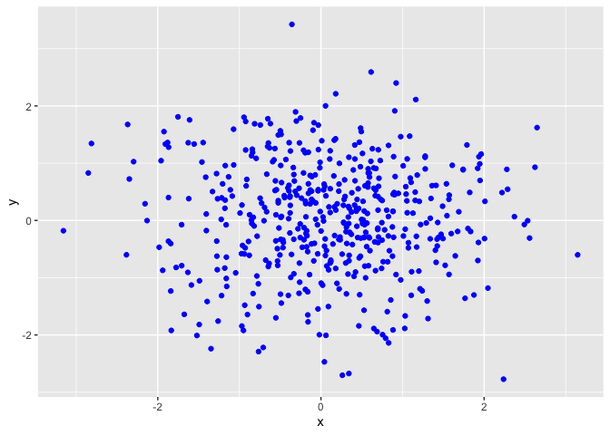
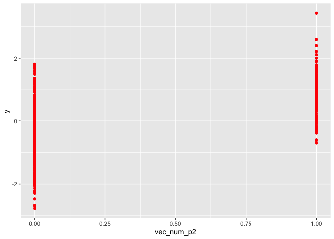
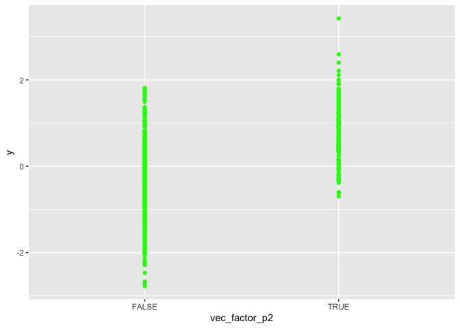

p8105\_hw1\_blm2156
================

``` r
library(tidyverse)
```

    ## ── Attaching packages ──────────────────────────────── tidyverse 1.2.1 ──

    ## ✔ ggplot2 3.2.1     ✔ purrr   0.3.2
    ## ✔ tibble  2.1.3     ✔ dplyr   0.8.3
    ## ✔ tidyr   0.8.3     ✔ stringr 1.4.0
    ## ✔ readr   1.3.1     ✔ forcats 0.4.0

    ## ── Conflicts ─────────────────────────────────── tidyverse_conflicts() ──
    ## ✖ dplyr::filter() masks stats::filter()
    ## ✖ dplyr::lag()    masks stats::lag()

# Problem 1

``` r
problem_1_df = tibble(
  vec_numeric = rnorm(8),
  vec_logical = vec_numeric > 0,
  vec_character = c("hello", "hi", "hey", "day", "night", "goodbye", "bye", "goodnight"),
  vec_factor = factor(c("low", "low", "moderate", "moderate", "moderate", "moderate", "high", "high"))
)


## Means of each variable in my dataframe
mean(pull(problem_1_df, vec_numeric))
```

    ## [1] -0.5094895

``` r
mean(pull(problem_1_df, vec_logical))
```

    ## [1] 0.25

``` r
mean(pull(problem_1_df, vec_character))
```

    ## Warning in mean.default(pull(problem_1_df, vec_character)): argument is not
    ## numeric or logical: returning NA

    ## [1] NA

``` r
mean(pull(problem_1_df, vec_factor))
```

    ## Warning in mean.default(pull(problem_1_df, vec_factor)): argument is not
    ## numeric or logical: returning NA

    ## [1] NA

I am able to find the mean of my numeric vector (random sample of size 8
from a standard Normal distribution) and my logical vector (logical
vector indicating whether elements of the sample are greater than 0).

I am not able to find the mean of my character vector (character vector
of length 8 comprised of both numeric and factor) nor my factor vector
(factor vector of length 8, with 3 different factor “levels”). This is
because neither vector completely contains numeric variables. Each
contain some or all variables in the “text” format.

``` r
as.numeric(pull(problem_1_df, vec_logical))
as.numeric(pull(problem_1_df, vec_character))
as.numeric(pull(problem_1_df, vec_factor))
```

The as.numeric function converts the variables that were written in my
logical and factor vectors to numeric vectors. This does explain what
happens when we take the mean of the logical, character, and factor
vectors. The logical vector converted our True/False answers into 1’s
and 0’s. The as.numeric function was unable to convert my character
vector into a numeric vector as every variable was text; however, if I
included numeric variables in the original vector, this function would
convert those numbers. My factor vector was converted into different
groups. My “low” variable was converted to the number 2, my “moderate”
variable was converted to the number 3, and my “high” variable was
converted to the number 1. These corresponding numbers explain how R was
able to produce a mean for these
vectors.

``` r
as.numeric(pull(problem_1_df, vec_logical))*(pull(problem_1_df, vec_numeric))
```

    ## [1] 0.0000000 0.0000000 0.2806415 0.8138930 0.0000000 0.0000000 0.0000000
    ## [8] 0.0000000

``` r
as.factor(pull(problem_1_df, vec_logical))*(pull(problem_1_df, vec_numeric))
```

    ## Warning in Ops.factor(as.factor(pull(problem_1_df, vec_logical)),
    ## (pull(problem_1_df, : '*' not meaningful for factors

    ## [1] NA NA NA NA NA NA NA NA

``` r
as.numeric(as.factor(pull(problem_1_df, vec_logical))*(pull(problem_1_df, vec_numeric)))
```

    ## Warning in Ops.factor(as.factor(pull(problem_1_df, vec_logical)),
    ## (pull(problem_1_df, : '*' not meaningful for factors

    ## [1] NA NA NA NA NA NA NA NA

# Problem 2

``` r
problem_2_df = tibble(
  x = rnorm(500),
  y = rnorm(500),
  vec_logical = (x + y) > 1,
  vec_num_p2 = as.numeric(vec_logical),
  vec_factor_p2 = as.factor(vec_logical)
)
```

The size of the datatset `problem_2_df` is 500 rows and 5 columns.

The mean is -0.0765499. The median is -0.0550374. The standard deviation
is 1.0103296. The proportion of cases for which x + y \> 1 is
0.23.

``` r
ggplot(problem_2_df) + geom_point(aes(x = x, y = y), color = 'blue')
```

<!-- -->

``` r
ggsave("hw1_scatter_plot1.pdf")
```

    ## Saving 7 x 5 in image

``` r
ggplot(problem_2_df) + geom_point(aes(x = vec_num_p2 ,y = y), color = 'red')
```

<!-- -->

``` r
ggplot(problem_2_df) + geom_point(aes(x = vec_factor_p2 ,y = y), color = 'green')
```

<!-- -->
